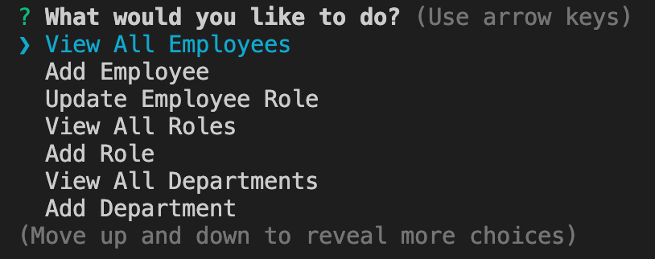

[](https://github.com/DAVFoundation/captain-n3m0/blob/master/LICENSE)

# Employee-Tracker
This command-line application that manages a company's employee database, using Node.js, Inquirer, and MySQL. The User is able to:

1. View a table of all the employees.
2. Add an Employee to the database.
3. Update an Employee's role in the database.
4. View all the roles found in the database.
5. Add a role to the database.
6. View all of the departments in the database.
7. Add a department to the database.

   ## Table of Contents 

  - [Installation](#installation)
  - [Usage](#usage)
  - [License](#license)
  - [How to Contribute](#contribute)
  - [Questions](#questions)

<br/>
<br/>
  
  ## Installation
  ```zsh
  npm install
  ```
  ## Usage
  Invoke the application with the command: 
  ```zsh
 node index.js
  ```
  After invoking the application you will be with prompted with seveal Options. See Below.


<p align="center">
  
</p>
  

  ## License
  The license used for this project: MIT
  ## Contribute
  If you would like to contribute please contact me.
  ## Walkthough
  https://drive.google.com/file/d/1Q5gK_gZlnFQEQ8DP4a1DLxAJ9Fbt1yZg/view?usp=sharing
  ## Questions
  To reach me please contact me in the email address below

  - GitHub: https://github.com/KarenHarley
  - Email: karenharley88@gmail.com
    
    
  
